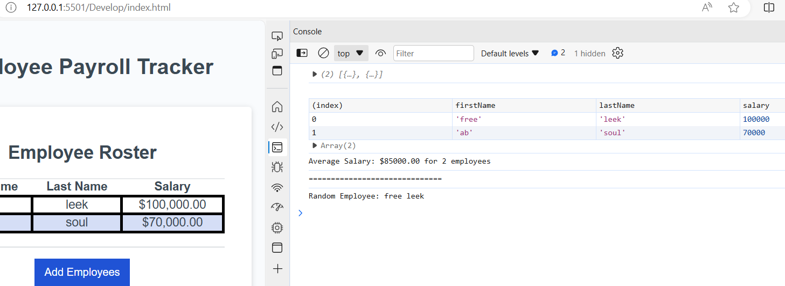

# Data-Budget

## Deatails
My task of this project was to modify the starter code so that it becomes a payroll tracker. In order to do so, I used javascript functions to allow me add employees first name, last name, and salary. Once entered, the console should have an Array of the information I entered as well as the average gross. Some of the challenges I faced in the project was creating my for loop properly. With small adjustments in my code, I was able to get the application to function properly.

###
To application

[https://github.com/Kydrian/Data-Budget] [https://kydrian.github.io/Data-Budget/]

#### Resources
I would like to thank My instructor for helping me debug issue with my code. I would also like to thank my TA for assisting me throughout this challenge as well. Lastly, I would like to thank my fellow collegues for additional help. 